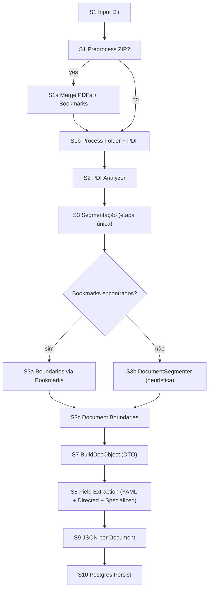
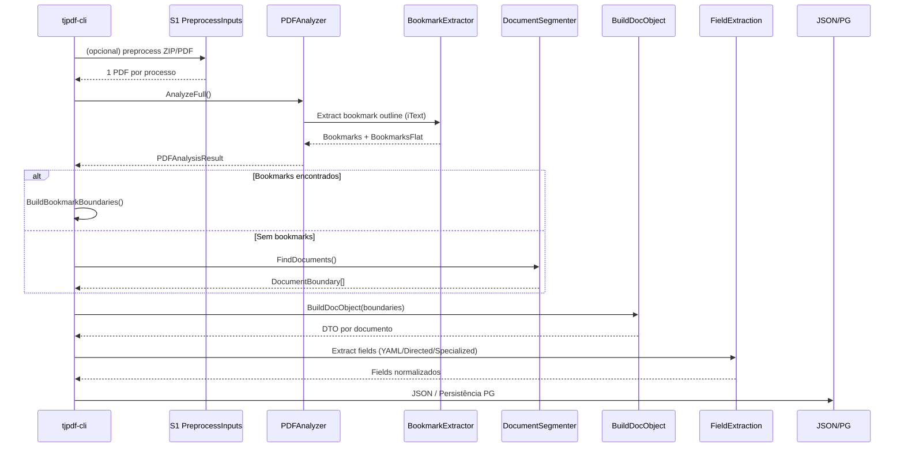

# Fluxo Detalhado do Pipeline TJPB (TJPDF)

Atualizado em: **2025-12-24 02:06:07 -03**

Este documento descreve **o caminho completo** dos arquivos e a execução do pipeline **desde a ingestão**, até a geração do JSON e a persistência no Postgres. O objetivo é servir como referência única para o time (e para agentes) sobre **como o pipeline realmente opera** hoje.

Mapa encapsulado (visão macro): `docs/PIPELINE_TJPB_CORE.md`

---

## Fluxograma com códigos (S1–S11)

```
[S1 Input Dir]
   |
   v
[S1 Preprocess ZIP?]
   |-- yes --> [S1a Merge PDFs + Bookmarks] --> [S1b Process Folder + PDF]
   |-- no  ------------------------------------> [S1b Process Folder + PDF]
                     |
                     v
[S2 PDFAnalyzer]
                     |
                     v
      [S3 Segmentação (etapa única)]
                 |
     {Bookmarks encontrados?}
          sim           não
           |             |
           v             v
 [S3a Boundaries via  [S3b DocumentSegmenter
  Bookmarks]           (heurística)]
 (PDFAnalyzer.cs + BookmarkExtractor.cs +    (TjpdfPipeline.Core/Utils/
  PipelineTjpbCommand.cs)                      DocumentSegmenter.cs)
           \\           /
            \\         /
             v       v
     [S3c Document Boundaries]
     (DocumentBoundary model)
                     |
                     v
     [S7 BuildDocObject (DTO por documento)]
     (PipelineTjpbCommand.cs: BuildDocObject)
          |   - monta chaves de header/footer/origem/assinatura no DTO
          |   - define doc_label/doc_type
          |   - valida despacho/certidão/requerimento
          v
   [S8 Field Extraction (YAML + Directed + Specialized)]
                     |
                     v
             [S9 JSON per Document]
                     |
                     v
               [S10 Postgres Persist]
```

**Nota:** a etapa **S3** engloba os procedimentos internos **S3a–S3c** (bookmarks vs heurística + boundaries). O DTO começa em **S7** (BuildDocObject).

---

## Fluxograma (Mermaid)



---

## Sequence (Mermaid)



### S3 — Núcleo (arquivos e funções)

**Bookmarks (quando existem)**
- **Extração/flatten do outline** (usa **iText**): `src/TjpdfPipeline.Core/PDFAnalyzer.cs`
  - `ExtractBookmarkStructure()`, `FlattenBookmarks(...)`
- **Parser de outline** (iText `/Outlines`, `/Dests`, `/Names`): `src/TjpdfPipeline.Core/Utils/BookmarkExtractor.cs`
- **Conversão em boundaries**: `src/TjpdfPipeline.Cli/Commands/PipelineTjpbCommand.cs`
  - `ExtractBookmarksForRange(...)`, `BuildBookmarkBoundaries(...)`
> **Observação**: a pipeline **usa o mesmo core** do `fetch-bookmark-titles` (PDFAnalyzer + BookmarkExtractor), lendo **títulos e páginas** dos bookmarks via iText.

**DocumentSegmenter (quando não há bookmarks)**
- **Heurísticas de segmentação**: `src/TjpdfPipeline.Core/Utils/DocumentSegmenter.cs`
  - `CalculatePageScores(...)` usa padrões iniciais, assinaturas finais, densidade, mudança de fontes, mudança de tamanho de página, assinatura por imagem, vizinhança, texto em margem superior e headers em maiúsculas.
  - `IdentifyBoundaries(...)`, `GroupAdjacentPages(...)`, `ValidateAndAdjust(...)`

**Modelo de boundary**
- `src/TjpdfPipeline.Core/Models/DocumentSegmentationConfig.cs`
  - `DocumentBoundary`

---

## 1) Ingestão (antes do PDFAnalyzer)

O pipeline **começa antes do PDFAnalyzer**. A primeira etapa é a **ingestão/organização dos arquivos**, principalmente quando os insumos chegam em ZIP.

### S1 — Entrada/organização do processo (Input Dir)

**Objetivo**  
Padronizar a entrada em **uma pasta por processo** contendo **um único PDF** (mergeado se veio de ZIP).

**O que acontece aqui**:
1. Detecta ZIPs no input.  
2. Descompacta e mergeia PDFs internos.  
3. Cria bookmarks por arquivo (nome do arquivo vira título do bookmark).  
4. Gera uma pasta por processo e um PDF final por processo.

**Entrega (saída da etapa)**  
- **Diretório de processo** (1 por processo)  
- **PDF único dentro do diretório**  
  - Se veio de ZIP: o PDF é **mergeado**  
  - Se veio avulso: o PDF é o próprio arquivo original  
- **Bookmarks criados** (somente quando veio de ZIP):  
  cada bookmark tem o **título igual ao nome do arquivo PDF original** do ZIP.  
  *(observação: PDFs avulsos podem ter bookmarks próprios, mas esses são lidos no S3 pelo PDFAnalyzer).*
  
**Comportamento em lote**  
- Se entram **10/20/30 PDFs ou ZIPs**, saem **10/20/30 diretórios**, cada um com **um único PDF** dentro.  
- Para ZIPs: o PDF é mergeado e cada arquivo interno vira **um bookmark** com seu nome original.  
- É gerado um arquivo `<processo>_arquivos.txt` com a lista dos nomes originais que viraram bookmarks.

**Arquivos envolvidos**  
- `src/TjpdfPipeline.Cli/Commands/PreprocessInputsCommand.cs`  
  - `Execute(...)`  
  - `MergeZipToPdf(...)`  
  - `CopyPdfWithTitle(...)`  
  - `DeriveProcessName(...)`  
- `src/TjpdfPipeline.Cli/Commands/PipelineTjpbCommand.cs`  
  - `PreprocessZipInbox(...)`

**Comando dedicado** (opcional, mas recomendado para isolar a ingestão):
`preprocess-inputs`

**Arquivo**:
`src/TjpdfPipeline.Cli/Commands/PreprocessInputsCommand.cs`

**Arquivos e funções (repo)**:
- `src/TjpdfPipeline.Cli/Commands/PreprocessInputsCommand.cs`
  - `Execute(...)` (orquestra ingestão)
  - `MergeZipToPdf(...)` (merge + bookmarks por arquivo)
  - `WriteMergeList(...)` (gera lista `<processo>_arquivos.txt`)
  - `CopyPdfWithTitle(...)` (PDF avulso)
  - `DeriveProcessName(...)` (número do processo)

**Observação**:
- Quando o pipeline roda direto com `pipeline-tjpb`, ele **faz esse preprocess automaticamente** se encontrar ZIP.
- Quando não há ZIP, o PDF já é tratado como “mergeado”.

---

## 2) Entrada e resolução de diretórios

## 2) Abertura e análise do PDF (PDFAnalyzer)

**Arquivo**: `src/TjpdfPipeline.Core/PDFAnalyzer.cs`

**Entrada do pipeline** (após preprocess):
- Cada arquivo PDF é analisado por `PDFAnalyzer.AnalyzeFull()`.

**Entrega (camada RAW genérica)**  
- JSON estruturado **por PDF** (`PDFAnalysisResult`) com:
  - texto/words/coords/linhas
  - headers/footers
  - bookmarks (extração unificada via `BookmarkExtractor`)
  - metadados e assinaturas  
- Este é o **RAW genérico** que alimenta todas as etapas específicas.

**Chaves mais usadas pela próxima camada (S4+)**  
- `BookmarksFlat` (base da segmentação por bookmark)  
- `Pages[].TextInfo.PageText` (texto bruto por página)  
- `Pages[].TextInfo.Words` (words/coords)  
- `Pages[].TextInfo.Lines` (linhas)  
- `Pages[].TextInfo.Headers` / `Footers`  
- `DocumentInfo.TotalPages`  
- `Signatures`

**Notas importantes (qualidade do RAW)**  
- O texto é **tabulado/espaciado** usando words/coords (métrica de gaps) para evitar “texto colado”.  
- Bookmarks usam o **BookmarkExtractor** (mesma lógica do comando `fetch-bookmark-titles`): Outlines API + fallback `/Outlines` e resolução por **/Dest, /A e NameTree (/Dests, /Names)**.

**O que o analyzer produz** (estrutura `PDFAnalysisResult`):
- Metadados (`Metadata`, `XMPMetadata`)
- Informações do documento (`DocumentInfo`)
- Páginas analisadas (`Pages`)
  - texto completo
  - linhas, palavras e bounding boxes
  - headers/footers detectados
  - fontes
  - recursos (imagens, anotações etc.)
- Assinaturas digitais
- Bookmarks (outline tree)
- Bookmarks flatten (`BookmarksFlat`)

Esse resultado **é a base de tudo que vem depois**.

**Arquivos e funções (repo)**:
- `src/TjpdfPipeline.Core/PDFAnalyzer.cs`
  - `AnalyzeFull()` (pipeline completo de análise)
  - `AnalyzePages()` / `AnalyzePageText(...)`
  - `ExtractBookmarkStructure()` + `FlattenBookmarks(...)`
  - `ExtractDigitalSignatures()`

**Validação de bookmarks (após S3)**  
- `fetch-bookmark-titles --input-file <pdf>`  
  - lista **título + página** de cada bookmark  
- `bookmark-paragraphs --input-file <pdf> --all`  
  - usa as páginas dos bookmarks para inspecionar início/fim dos documentos

---

## Comandos de etapa (validação progressiva)

Use estes comandos para validar cada etapa isoladamente:

- `tjpb-s1` → executa **S1** e gera `stage1_manifest.json`
- `tjpb-s3` → executa **S2** (RAW/PDFAnalyzer) e gera `stage3_outputs.json`
- `tjpb-s7` → executa **S3–S7** (segmentação + BuildDocObject) e gera `stage7_outputs.json`

---

## 3) Segmentação de documentos (Bookmarks vs Heurística)

**Arquivo**: `src/TjpdfPipeline.Cli/Commands/PipelineTjpbCommand.cs`

**Ordem de decisão**:
1) Se `BookmarksFlat` estiver preenchido, o pipeline cria **DocumentBoundary** por bookmark:
   - método `BuildBookmarkBoundaries`.
   - Cada boundary tem `StartPage`, `EndPage`, `Title` e `RawTitle`.
2) Se não houver bookmarks, usa fallback:
   - `DocumentSegmenter.FindDocuments()`.
   - Arquivo: `src/TjpdfPipeline.Core/Utils/DocumentSegmenter.cs`
   - Heurísticas: padrões textuais, assinaturas, densidade, fontes, mudança de página etc.

**Observação**:
- Bookmarks são o caminho preferencial e **determinístico**.
- Fallback heurístico é **apenas substituto** quando não há bookmark.

**Arquivos e funções (repo)**:
- `src/TjpdfPipeline.Cli/Commands/PipelineTjpbCommand.cs`
  - `ExtractBookmarksForRange(...)`
  - `BuildBookmarkBoundaries(...)`
- `src/TjpdfPipeline.Core/Utils/DocumentSegmenter.cs`
  - `FindDocuments(...)`
  - `CalculatePageScores(...)`, `IdentifyBoundaries(...)`, `ValidateAndAdjust(...)`

---

## 5) Seleção dos documentos (bookmark + sanitização + DT-OR)

Após a segmentação por bookmark, o pipeline **sanitiza o título** e usa os campos do JSON (DT-OR) para decidir **qual documento é despacho/certidão**.

**Lista de bookmarks usada**:
- `BookmarksFlat` (title + page + level) gerada pelo `PDFAnalyzer`.

**Sanitização do bookmark**:
- Método: `SanitizeBookmarkTitle` (remove números finais, sufixos SEI, prefixos etc.).
- O `doc_label` final é derivado do bookmark sanitizado.

**DT-OR (campos do JSON usados na seleção)**:
- `origin_main`, `origin_sub`, `origin_extra`
- `signer`, `signed_at`, `date_footer`
- `doc_head`, `doc_tail` *(somente despacho; doc_head inclui header+subheader + 1º parágrafo; doc_tail inclui último parágrafo + footer)*
- `process_line`, `interested_*`, `juizo_*`
- `percentual_blank` *(heurística de branco; quanto menor, mais preenchido)*

**Regras atuais de seleção (no código)**:
- **Despacho válido**: `is_despacho && doc_pages >= minPages && percentual_blank <= blank_max_pct && MatchesOrigin && MatchesSigner`.
  - `MatchesOrigin` usa *hints* de `configs/config.yaml` (anchors/header).
  - `MatchesSigner` usa `SignerHints` (ex.: Robson).
  - `minPages` e `blank_max_pct` vêm de `configs/config.yaml` (thresholds).
- **Certidão CM válida**: `is_certidao && MatchesOrigin && MatchesSigner`.
- **Despacho tipo**: apenas 2 flags finais:
  - `is_despacho_autorizacao` (inclui GEORC)
  - `is_despacho_encaminhamento` (inclui Conselho)

**Comandos úteis nessa etapa**:
- `fetch-bookmark-titles` (lista bookmarks + páginas)
- `bookmark-paragraphs` (primeiro/último parágrafo por bookmark)

**Arquivos e funções (repo)**:
- `src/TjpdfPipeline.Cli/Commands/PipelineTjpbCommand.cs`
  - `SanitizeBookmarkTitle(...)`
  - `NormalizeDocLabel(...)`
  - `BuildDocMeta(...)`
  - `MatchesOrigin(...)`, `MatchesSigner(...)`
  - `DetectDespachoTipo(...)`
- `configs/config.yaml`
  - `anchors.*`, `certidao.*`, `despacho_type.*`, `signerHints`
- `src/TjpdfPipeline.Cli/Commands/Analysis/FetchBookmarkTitlesCommand.cs`
- `src/TjpdfPipeline.Cli/Commands/Analysis/BookmarkParagraphsCommand.cs`

---

## Campos principais (ordem final para exportação)

1) **PROCESSO_ADMINISTRATIVO**  
2) **PROCESSO_JUDICIAL**  
3) **COMARCA**  
4) **VARA**  
5) **PROMOVENTE** *(autor do processo judicial)*  
6) **PROMOVIDO** *(réu do processo judicial)*  
7) **PERITO**  
8) **CPF_PERITO**  
9) **ESPECIALIDADE**  
10) **ESPECIE_DA_PERICIA**  
11) **VALOR_ARBITRADO_JZ**  
12) **VALOR_ARBITRADO_DE**  
13) **VALOR_ARBITRADO_CM**  
14) **VALOR_ARBITRADO_FINAL** *(não é soma)*  
15) **DATA_ARBITRADO_FINAL**

**Regra do valor arbitrado final**:
- Se houver **VALOR_ARBITRADO_CM**, ele é o final e a data é a **data da decisão do Conselho** (certidão CM).
- Se não houver CM, usar **VALOR_ARBITRADO_DE** e a data do **despacho**.
- Se não houver DE nem CM, usar **VALOR_ARBITRADO_JZ** e a data do **despacho/requerimento**.

---

## 6) Extração Despacho/Certidão (pipeline antigo portado)

**Arquivo**: `src/TjpdfPipeline.Core/TjpbDespachoExtractor/Extraction/DespachoExtractor.cs`

Após a segmentação, o pipeline executa:
- `DespachoExtractor.Extract()` para **identificar despacho e certidão CM**.
- Resultado é anexado ao documento por `FindBestDespachoMatch`.

Isso fornece campos adicionais além do YAML, especialmente para **certidão CM**.

**Arquivos e funções (repo)**:
- `src/TjpdfPipeline.Core/TjpbDespachoExtractor/Extraction/DespachoExtractor.cs`
  - `Extract(...)`
- `src/TjpdfPipeline.Core/TjpbDespachoExtractor/Extraction/CertidaoExtraction.cs`
- `src/TjpdfPipeline.Core/TjpbDespachoExtractor/Extraction/FieldExtractor.cs`

---

## 7) Construção do JSON por documento (BuildDocObject)

**Arquivo**: `src/TjpdfPipeline.Cli/Commands/PipelineTjpbCommand.cs` (método `BuildDocObject`)

Para cada boundary:

### 7.1 Texto e métricas
- `docText` = concatenação de páginas do documento.
- `lastPageText` e `lastTwoText` para footer/assinatura.
- Métricas:
  - `word_count`, `char_count`
  - `percentual_blank`
  - `fonts`, `images`, `page_size`

### 7.2 Cabeçalho/Rodapé
- Captura `header`, `footer` e `footer_signature_raw`.
- Extrai footer dominante (maior frequência de linhas).
- **Fallback de header**: se não houver header nativo, usa linhas do topo (band) da 1ª página.
- **Fallback de footer**: quando necessário, reconstrói `footer_signature_raw` pelo band de rodapé usando words/coords (não depende só de `lastPageText`).

### 7.3 DocSummary (top-level)
- Método `BuildDocSummary` gera:
  - `origin_main`, `origin_sub`, `origin_extra`
  - `signer`, `signed_at`, `date_footer`
  - `doc_head` (inicio do doc até o 1o paragrafo)
  - `doc_tail` (ultimo paragrafo até o fim, incluindo footer/assinatura)
  - `process_line`, `process_bbox`
  - `interested_*`, `juizo_*`
  - `header_hash`
  - `process_cnj`
- Assinatura/data consideram texto colapsado (letras espaçadas) quando o rodapé vem “quebrado”.

### 7.4 Fields (YAML + direcionados)
- `ExtractFields`: lê scripts em `configs/fields/*.yml`.
- `ExtractDirectedValues`: extratores dirigidos (JZ/DE/CM etc.).
- `AddDocSummaryFallbacks`: injeta valores do summary caso YAML não preencha.
- `NormalizeAndValidateFields`: valida e normaliza os resultados.
- `EnsureRequiredFields`: marca campos faltantes.

### 7.5 Forense
- `BuildForensics` cria:
  - `paragraphs`
  - `bands` (header/subheader/body/footer)
  - `anchors`, `repeat_lines`, `outlier_lines`
  - estatísticas de fonte e tamanho dominante

### 7.6 Flags de validação
- `is_despacho_valid` (>=2 páginas + origem + assinatura)
- `is_certidao_valid` (origem + assinatura)
- `is_requerimento_pagamento_honorarios`

**Arquivos e funções (repo)**:
- `src/TjpdfPipeline.Cli/Commands/PipelineTjpbCommand.cs`
  - `BuildDocObject(...)`
  - `BuildDocSummary(...)`
  - `ExtractFields(...)`
  - `ExtractDirectedValues(...)`
  - `AddDocSummaryFallbacks(...)`
  - `NormalizeAndValidateFields(...)`
  - `EnsureRequiredFields(...)`
  - `BuildForensics(...)`
- `configs/fields/*.yml`

---

## 8) Consolidação por processo

Após todos os documentos:
- Agrupa por processo (`GroupBy process`).
- Calcula `paragraph_stats` globais.

**Saída final**:
```
{
  process,
  pdf: { fileName, filePath, pages, sha256, fileSize },
  documents: [...],
  paragraph_stats
}
```

**Arquivos e funções (repo)**:
- `src/TjpdfPipeline.Cli/Commands/PipelineTjpbCommand.cs`
  - `BuildParagraphStats(...)`
  - agrupamento por `process`

---

## 9) Saídas possíveis

- **Persistência** (default):
  - `PgDocStore.UpsertProcess` grava JSON no Postgres.
- **Print JSON**:
  - `--print-json` imprime no stdout.
- **Fields only**:
  - `--fields-only` imprime somente os campos principais.
- **Debug summary**:
  - `--debug-docsummary` imprime header/footer + resumo e termina.

**Arquivos e funções (repo)**:
- `src/TjpdfPipeline.Core/Utils/PgDocStore.cs`
  - `UpsertProcess(...)`
  - `UpsertRawProcess(...)`
  - `UpsertRawFile(...)`

---

## 10) Comandos auxiliares (diagnóstico)

- `preprocess-inputs`: pré-processamento explícito para ZIPs.
- `fetch-bookmark-titles`: lista bookmarks e páginas.
- `bookmark-paragraphs`: primeiro/ultimo parágrafo por bookmark.
- `footer`: inspeção de assinatura e data.

**Arquivos (repo)**:
- `src/TjpdfPipeline.Cli/Commands/PreprocessInputsCommand.cs`
- `src/TjpdfPipeline.Cli/Commands/Analysis/FetchBookmarkTitlesCommand.cs`
- `src/TjpdfPipeline.Cli/Commands/Analysis/BookmarkParagraphsCommand.cs`
- `src/TjpdfPipeline.Cli/Commands/Analysis/PdfInfoCommand.cs`
- `src/TjpdfPipeline.Cli/Commands/Analysis/FooterCommand.cs`

---

## 11) Pontos críticos atuais

1) Bookmarks são **fundamentais** para segmentação correta.
2) Pré-processamento de ZIP precisa produzir bookmarks consistentes.
3) Fields dependem de:
   - YAML (`configs/fields/*.yml`)
   - Extratores dirigidos (`ExtractDirectedValues`)
   - DocSummary (fallbacks)

---

## 12) Onde olhar primeiro (para debug)

- **PDFAnalyzer**: `src/TjpdfPipeline.Core/PDFAnalyzer.cs`
- **Segmentação**: `BuildBookmarkBoundaries` + `DocumentSegmenter`
- **Fields**: `configs/fields/*.yml` + `ExtractFields`
- **Summary/Assinatura**: `BuildDocSummary`, `ExtractSignedAt`, `ExtractSigner`
- **Persistência**: `PgDocStore.UpsertProcess`
